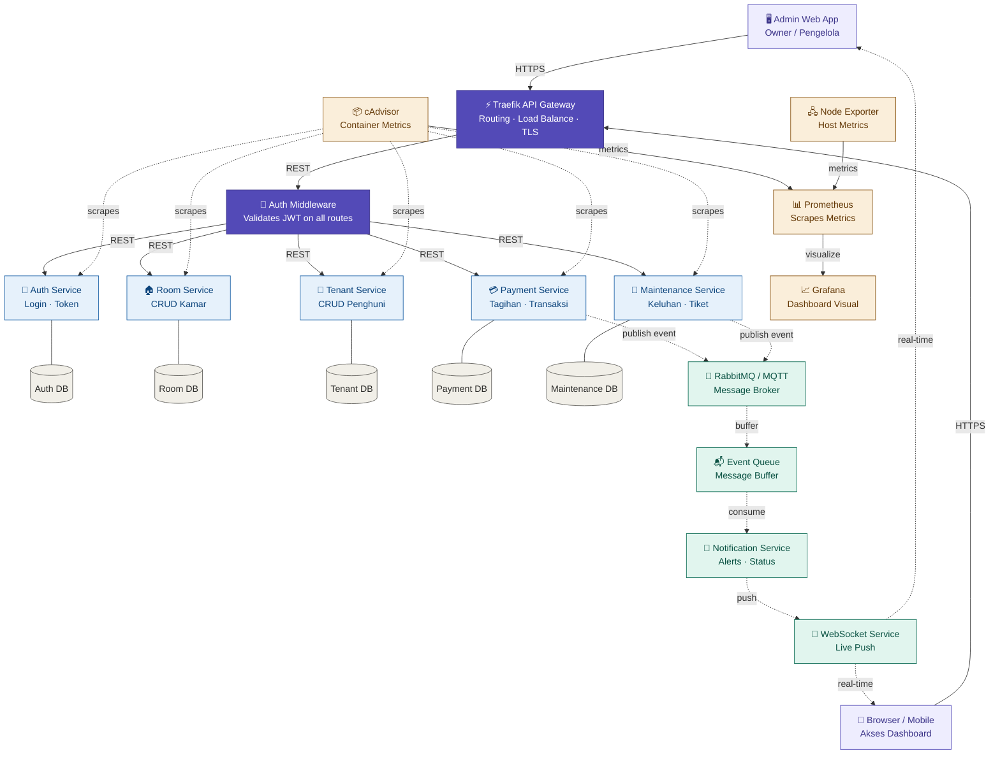

# Desain Arsitektur Microservice - Sistem Manajemen Kos

## Legend

| Style | Layer |
|---|---|
| 🟣 Purple | Client & Gateway / Security |
| 🔵 Blue | Core Business Services |
| ⬜ Gray | Isolated Databases |
| 🟢 Green | Real-time & Async Layer |
| 🟡 Amber | Monitoring Stack |

Solid arrows `-->` = REST API communication  
Dashed arrows `-.->` = WebSocket / Message Broker (async/real-time)

## Container Count: 22 Total

| Layer | Containers |
|---|---|
| Client | Admin Web App, Browser/Mobile |
| Gateway & Security | Traefik, Auth Middleware |
| Core Services | Auth, Room, Tenant, Payment, Maintenance |
| Databases | Auth DB, Room DB, Tenant DB, Payment DB, Maint. DB |
| Real-time | RabbitMQ, Event Queue, Notification, WebSocket |
| Monitoring | Prometheus, Grafana, cAdvisor, Node Exporter |
